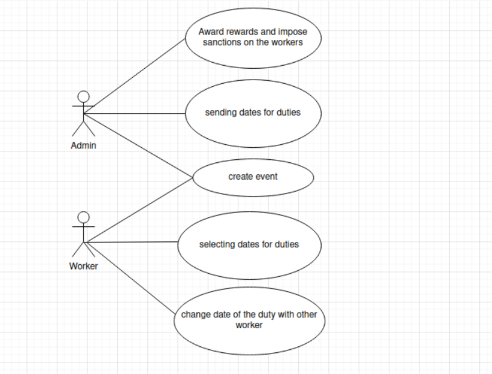
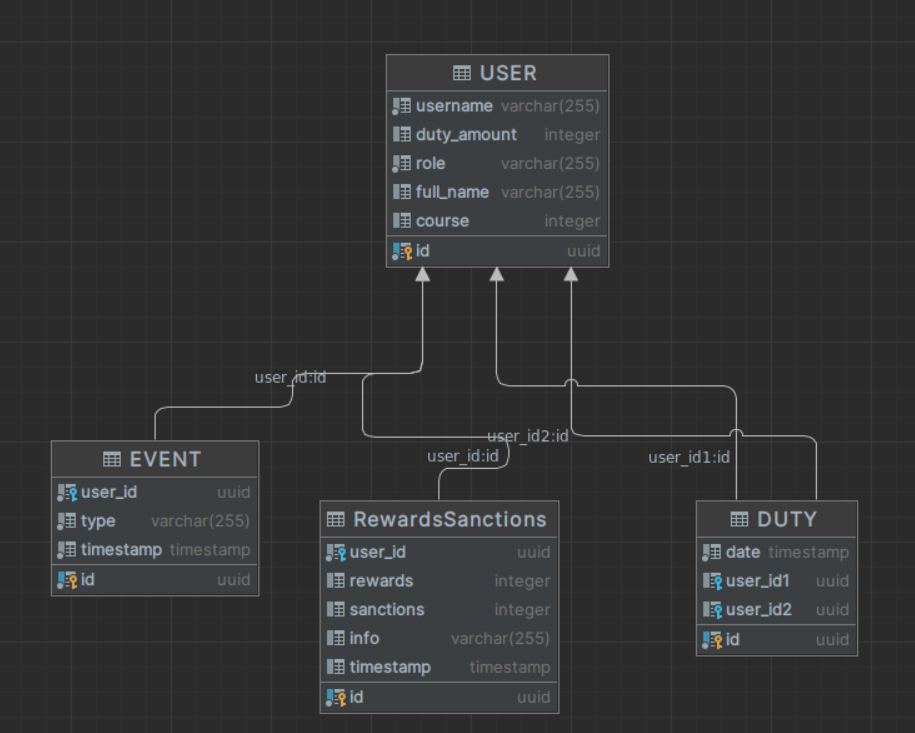

<!-- TABLE OF CONTENTS -->

  
Table of Contents

  <ol>
    <li>
      <a href="#about-the-project">About The Project</a>
      <ul>
        <li><a href="#built-with">Built With</a></li>
      </ul>
    </li>
    <li>
      <a href="#getting-started">Getting Started</a>
    </li>
    <li><a href="#UseCase">Use Case</a></li>
    <li><a href="#ER">ER Diagram</a></li>
    <li><a href="#license">License</a></li>
    <li><a href="#contact">Contact</a></li>
</ol>

# DSSDutyBot(Dormintory Security Service Duty Bot)
<!-- ABOUT THE PROJECT -->
## About The Project
DSSDutyBot(Dormintory Security Service Duty Bot) is an application for selecting duty dates and notifying staff of events and incidents (fire alarm, violation of accommodation rules, etc.).
This project is designed to correct the following problems:
* Non-biased selection of the duty date.
* Increasing the speed of response to incidents by means of an alert system.
* Maintain statistics on rewards and sanctions.

(<a href="#DSSDutyBot">back to top</a>)

### Built With

(<a href="#DSSDutyBot">back to top</a>)

## Getting Started
//todo

(<a href="#DSSDutyBot">back to top</a>)

## Use Cases

Более подробно:
  Имеется две роли пользователей: Администратор(Admin) и Сотрудник(Worker).
Основная цель проекта - улучшить процесс выбора даты дежурств. Предполагается, что администратор посылает дату дежурства(обычно последовательно, начиная с первого числа месяца) у остальных пользователей появляется кнопка "Взять", таким образом дежурство достается двум(если в конкретном месяце дежурят оп одному человеку, то одному) нажавшим на кнопку.
Имеется функционал вывода информации о дежурствах в конкретном месяце(расписание). Два пользователя при согласии каждого могут поменять дату дежурств.
  Админимстратор имеет право поощрять сотрудников(в виде уменьшения количества дежурств) или, наоборот, налагать санкции(в виде увеличения количества дежурств).
  Каждый пользователь(администратор и сотрудник) имеет право добавлять событие информация о котором распространяется на всех польщователей(Например, событие "Пожарная тревога 1026 комната").
Также имеется функционал напоминания(например событие "Собрание актовый зал 22:00) о событиях и дежурствах(для конкретного сотрудника.

(<a href="#DSSDutyBot">back to top</a>)

## ER

(<a href="#DSSDutyBot">back to top</a>)

<!-- LICENSE -->

## License
Distributed under the MIT License. See `LICENSE.txt` for more information.

(<a href="#DSSDutyBot">back to top</a>)

<!-- CONTACT -->
## Contact
  * gmail.com: gorodetskiy39@gmail.com

(<a href="#DSSDutyBot">back to top</a>)
